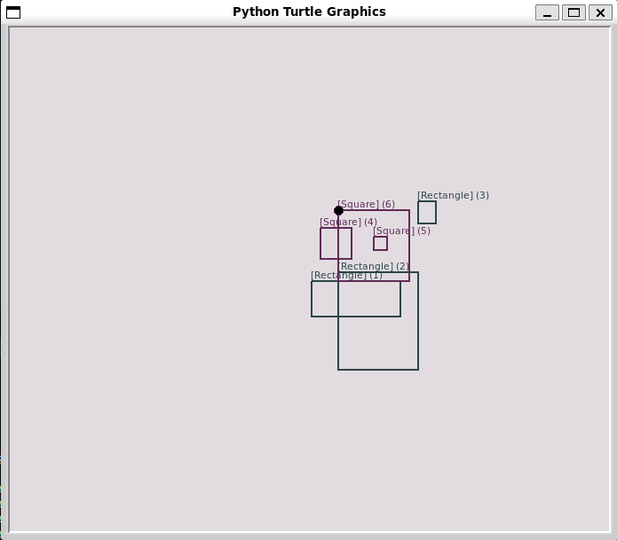

# Python - Almost a circle

This project emphasizes some applications of:

* Classes(public/private class/instance attributes, inheritance)
* Function arguments(`*args`, `**kwargs`)
* JSON serialization/deserialization
* File opening, read/write

----

[models](./models/) contains the class definitions:

* [Base](./models/base.py): the base class with methods for:
  * validating and assigning `id`
  * JSON serialization/deserialization
  * saving/loading objects to/from `.json` and `.csv` files
  * drawing the objects using the Turtle graphics module

* [Rectangle](./models/rectangle.py): inherits from `Base` and defines methods for:
  * validating and assigning `width`, `height` and coordinates(`x`, `y`)
  * calculating area
  * string representation - `[Rectangle] (<id>) <x>/<y> - <width>/<height>`
  * printing to the console the rectangle using the `#` symbol i.e.
  * updating an instance attributes using `*args` or `**kwargs`
  * getting the object's dictionary representation.

* [Square](./models/square.py) inherits from the `Rectangle` class and has a new attribute `size` that is equal to both `width` and `height` of `Rectangle`

An example:

```python
r = Rectangle(3, 4, 1, 2)
print(r)
print(r.area())
print(r.to_dictionary())
r.display()

s = Square(5, 2, 2)
print(s)
print(s.area())
print(s.to_dictionary())
s.display()
```

outputs:

```bash
[Rectangle] (1) 1/2 - 3/4
12
{'id': 1, 'width': 3, 'height': 4, 'x': 1, 'y': 2}


 ###
 ###
 ###
 ###    
[Square] (2) 2/2 - 5
25
{'id': 2, 'size': 5, 'x': 2, 'y': 2}


  #####
  #####
  #####
  #####
  #####
```

Turtle drawing:

```python
list_rectangles = [Rectangle(100, 40),
                       Rectangle(90, 110, 30, 10),
                       Rectangle(20, 25, 120, 90)]
list_squares = [Square(35, 10, 60),
                Square(15, 70, 50),
                Square(80, 30, 80)]

Base.draw(list_rectangles, list_squares)
```


